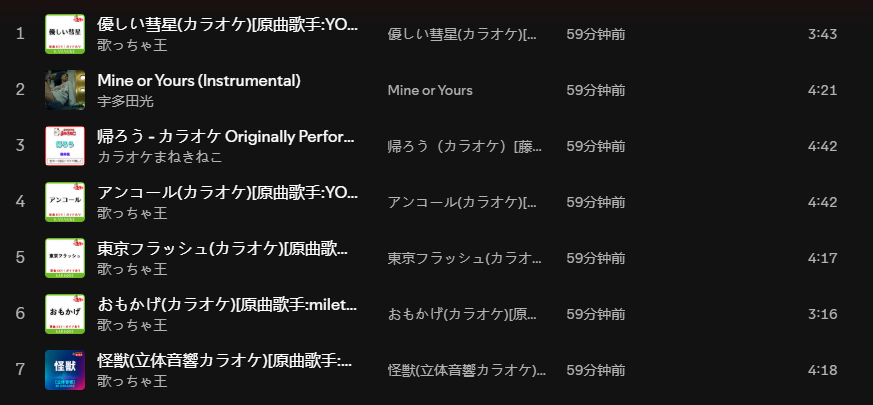

# Instrumental Playlist

## プロジェクト概要

Instrumental Playlistは、Spotifyの既存プレイリストをもとに、歌声のないインストゥルメンタル曲だけで構成された新しいプレイリストを作成するためのWeb APIアプリケーションです。

このプロジェクトでは、Spotify上のプレイリスト取得、楽曲検索、プレイリスト作成・編集といった機能をREST APIとして提供し、元のプレイリストの雰囲気や楽曲の方向性をできるだけ保ちながら、作業や思考に向いたインストゥルメンタル版プレイリストを生成することを目指します。

## プロジェクトの動機

考え事や作業に集中したいとき、歌声のないインストゥルメンタル音楽は、思考を妨げずに音楽を楽しむための有効な選択肢になります。

Spotifyには、ポップス、クラシック、サウンドトラックなど多様なプレイリストがあり、ポップス楽曲のインストゥルメンタル版も存在します。一方で、特定のポップス・プレイリストに対応するインストゥルメンタル版プレイリストはほとんど用意されていません。

このプロジェクトは、好きなポップスのメロディーや雰囲気を楽しみながら、集中して考え事や作業をしたい人を支援することを目的としています。

## 開発方針

現在の実装はGo製HTTPサーバーとして起動するWeb APIアプリケーションです。プレイリスト操作や変換処理は、Spotify Web APIを内部で呼び出すREST APIとして提供します。

Spotifyのプレイリスト編集にはユーザー承認済みアクセストークンが必要です。Spotifyログイン後は、サーバーがプロセス内メモリに保存した最新のユーザーtokenをプレイリスト系REST APIで自動的に使います。クライアントから`Authorization: Bearer <spotify_access_token>`を明示した場合は、そのヘッダー値を優先します。Spotify Client Secretなどの秘密情報は`.env`から読み込み、APIレスポンスには返しません。

## ローカル実行

`.env.example`を参考に`.env`を作成します。

```env
HTTP_ADDR=:8080
SPOTIFY_CLIENT_ID=replace-with-spotify-client-id
SPOTIFY_CLIENT_SECRET=replace-with-spotify-client-secret
SPOTIFY_REDIRECT_URI=http://127.0.0.1:8080/oauth/spotify/callback
SPOTIFY_BASE_URL=https://api.spotify.com
SPOTIFY_ACCOUNTS_BASE_URL=https://accounts.spotify.com
```

サーバーを起動します。

```sh
go run ./cmd/instrumental-playlist
```

確認用エンドポイント:

```sh
curl http://localhost:8080/health
curl http://localhost:8080/v1/config
curl http://localhost:8080/v1/auth/status
curl -X POST http://localhost:8080/v1/auth/logout
```

`/v1/config`はSpotify Client Secretそのものを返さず、設定済みかどうかだけを返します。APIの詳細は[docs/api.md](docs/api.md)を参照してください。

Spotifyにログインする場合は、サーバー起動後にブラウザーで次のURLを開きます。

```text
http://localhost:8080/oauth/spotify/login
```

このエンドポイントはSpotify Accountsのログインページへ自動的にリダイレクトします。ログイン完了後、Spotifyは`SPOTIFY_REDIRECT_URI`に設定した`/oauth/spotify/callback`へ戻り、サーバーは取得したユーザーtokenをプロセス内メモリに保存して成功ページを表示します。成功ページにはtoken metadataだけを表示し、access tokenとrefresh token本体は表示しません。

ログイン状態は次のAPIで確認できます。

```sh
curl http://localhost:8080/v1/auth/status
```

このAPIはプロセス内メモリにユーザーtokenが保存されているかを返します。サーバーを再起動するとログイン状態は消えます。

ログイン済みであれば、ユーザーのプレイリスト操作APIは`Authorization`ヘッダーなしで実行できます。

```sh
curl http://localhost:8080/v1/playlists
curl http://localhost:8080/v1/playlists/{playlistID}/tracks
curl "http://localhost:8080/v1/search/tracks?term=piano"
```

`GET /v1/playlists/{playlistID}/tracks`はアプリ内の互換ルート名です。Spotifyへは現行の`GET /v1/playlists/{playlist_id}/items`を呼び出します。Spotify側の制限により、ログインユーザーがownerまたはcollaboratorではないplaylistは`403 Forbidden`になる場合があります。

既存プレイリストからインストゥルメンタル版プレイリストを作成する場合は、まず`GET /v1/playlists`で表示された番号を確認します。

```sh
curl http://localhost:8080/v1/playlists
```

出力例:

```text
1	Focus Playlist	https://open.spotify.com/playlist/example
```

その番号を`playlist_number`として`POST /v1/conversions`へ渡します。

```sh
curl -X POST http://localhost:8080/v1/conversions \
  -H "Content-Type: application/json" \
  -d '{"playlist_number":1}'
```

変換APIは選択したプレイリストの各曲についてSpotifyでインストゥルメンタル候補とカラオケ候補を検索し、見つかった曲を新しい非公開プレイリストへ追加します。サーバーを再起動すると、ログイン状態と`/v1/playlists`で保存した番号対応は消えるため、再度ログインまたはプレイリスト一覧の取得が必要です。

ログアウトする場合は、プロセス内メモリのユーザーtokenを削除します。

```sh
curl -X POST http://localhost:8080/v1/auth/logout
```

## 生成AIとのやり取り

###　最初にプランを立てたところ
```
Apple Musicのプレイリストを、純粋なインストゥルメンタル曲のみで構成されたプレイリストへ変換するシステムを設計したいと考えています。

まずはGo言語を使用して、バックエンド機能のみを備えたバージョンを実装する予定です。変換機能はコマンドラインツールから呼び出す形とし、フロントエンドやGUIによる可視化・操作機能は実装しません。

基本モジュールとして、以下の機能を想定しています。

- ユーザー認証
- プレイリスト一覧の取得
- プレイリストの新規作成・削除
- 楽曲検索
- プレイリスト内の楽曲編集

その後、これらの基本モジュールを組み合わせて、既存のプレイリストをインストゥルメンタル版のプレイリストへ変換する機能を実装します。

このシステムについて、追加で必要となるモジュールを補足したうえで、具体的な設計案と実装手順を策定してください。
```

### プロジェクトをwebアプリケーションとspotifyの方向に移した
```
プロジェクトをWebアプリケーションとして再構成し、当初予定していた操作をREST API経由で実行できるようにしたいと考えています。
そのため、Developer Tokenは.envファイル内に保存するだけでよく、システムディレクトリへアクセスする必要はありません。
現在の開発進捗も踏まえたうえで、新しい開発計画を提示し、既存コードを変更するための手順も追加してください。
```
```
開発者権限の問題により、既存のApple Musicプレイリスト編集機能をSpotifyのプレイリスト編集機能へ変更したいと考えています。
計画を改めて策定し、どのファイルに対して、どのような変更を行う必要があるかを示してください。
```
### ロードマップ通りに機能を実装する時
```
roadmap.mdのphase 3を開始する。progress.mdを参照し今の進捗を把握してから、コーディングはbackend.mdで、テスト用例はqa.mdでやってください。spotifyのアクセスに必要なtokenは全部配置済み。
```
### conversionsの部分
```
楽器版の歌曲のサーチアルゴリズムを実装する。
apiはhttps://api.spotify.com/v1/search。
queryの部分、type=track&limit=10&market=JPは固定。
qは原曲のタイトルとinstrumental、あるいはタイトルとカラオケ。
二回searchして、返ってきた20個のitemはそれぞれ曲名、作者、URIだけの情報を保存する。
フィルターは次の実装。
```

## 詰まったところとどう乗り越えたか
1. プレイリストをインストゥルメンタル版へ変換することには成功したものの、リモート上でプレイリストを作成できない問題がありました。
 - ユーザートークンを確認し、権限を変更した後、API自体に問題がある可能性に気づきました。調査したところ、Codexが古いAPIを使用しており、プレイリストの作成や更新ができないことが判明しました。最新のAPIへ変更することで、この問題を修正しました。
2. インストゥルメンタル版楽曲の検索および変換の成功率が十分ではありません。
 - 失敗した例に対して、さまざまなクエリ構築方法を試しました。たとえば、曲名に括弧書きの補足情報が含まれている場合は、括弧以降の部分を削除しました。また、アーティスト名を検索キーワードに追加する際、名前の途中にスペースが含まれていると検索結果に大きく影響するため、アーティスト名のスペース以降の部分を削除するなどの対応を行いました。

## 次にやるなら何を変えるか
1. 現在のプロジェクトはバックエンドAPIのみで構成されており、操作性に課題があります。そのため、次のステップとして、操作性を向上させるためのフロントエンド画面を作成したいと考えています。
2. 開発時間の都合上、不正な入力に対するエラーハンドリングが十分でない可能性があります。
3. より優れた検索手法やマッチングアルゴリズムを採用することで、変換の成功率をさらに向上させられると考えています。

## 動作確認
1. ```curl localhost:8080/v1/auth/status```でログイン後の状態が確認できました。
 ```
 {"logged_in":true,"token":{"id":"EbjGyx6YSEbViSApws5cGkvwuCKByC9a","token_type":"Bearer","scope":"playlist-read-private playlist-modify-private playlist-modify-public","expires_at":"2026-07-07T01:00:22.0446986Z","has_refresh_token":true}}
 ```


2. ```curl "localhost:8080/v1/playlists"```でユーザーのplaylistが一覧できました。
```
1       my playlist #5  https://open.spotify.com/playlist/5aslkx2UBYboSzSr7teEhk
2       My top tracks playlist  https://open.spotify.com/playlist/4sEchx0gPBgR2nVCZXPO6Q
```
3. ```curl -X POST localhost:8080/v1/conversions -H "Content-Type: application/json" -d '{"playlist_number":2}'```でplaylistを選択し、インストゥルメンタル版のplaylistを作成できました。
### 元playlist

### 変換後
